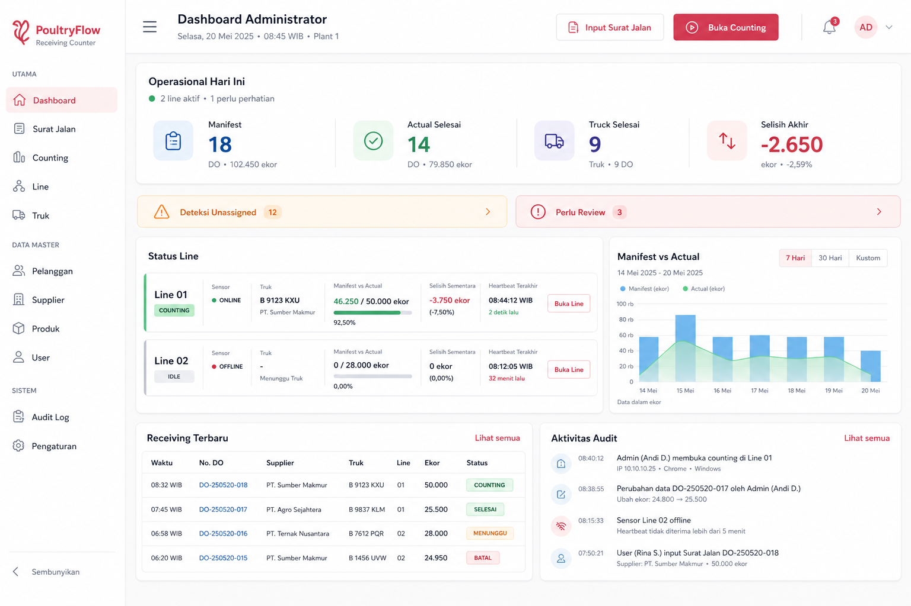

# Rencana Rombak Dashboard Admin

Status: **DISETUJUI UNTUK IMPLEMENTASI**
Tanggal keputusan: **12 Agustus 2026**

Dokumen ini adalah handoff decision-complete untuk agent yang mengimplementasikan
refinement Dashboard Admin. Baca `AGENTS.md` dan seluruh blueprint wajib sebelum mulai.

## Tujuan

Ubah Dashboard Admin menjadi dashboard bergaya **executive spacious** yang tetap kuat
untuk operasi harian. KPI hari ini menjadi fokus visual utama, diikuti alert yang perlu
tindakan, status setiap line, analitik dengan periode terpilih, receiving terbaru, dan
aktivitas audit.

Dashboard tetap berfungsi sebagai overview dan navigasi. Start, finish, dan cancel sesi
tidak boleh dilakukan langsung dari dashboard.

## Referensi Visual



Gambar di atas adalah referensi hierarchy, density, spacing, dan treatment visual. Nama,
angka, menu, tanggal, serta contoh data di dalam gambar bukan kontrak produk. Implementasi
harus memakai route, navigation, semantic token, copy, dan data nyata yang sudah ada.

Karakter visual yang harus dipertahankan:

- light mode yang lapang, tenang, dan premium;
- angka KPI besar dengan unit dan konteks yang jelas;
- warna status digunakan secara hemat melalui semantic token;
- status line dapat dipahami dalam waktu singkat;
- tidak memakai glassmorphism, dekorasi 3D, foto, atau gradient berlebihan;
- tidak mengulang full preset shadcn atau mengganti base primitive.

## Ruang Lingkup

Termasuk:

- halaman Dashboard Admin;
- komponen dashboard yang diperlukan;
- perluasan read-only API Dashboard Admin;
- adaptor data chart dan tipe TypeScript;
- deep-link pemilihan line pada halaman Counting Admin;
- test kalkulasi, query periode, dan helper UI;
- QA responsif serta state loading, error, dan empty.

Tidak termasuk:

- Dashboard Operator;
- perubahan schema atau migration database;
- perubahan aturan autentikasi, authorization, sesi, sensor ingestion, atau audit;
- start, finish, atau cancel langsung dari Dashboard Admin;
- dark mode atau migrasi design system baru.

## Hierarchy Halaman Final

### 1. Header Ringkas

- Judul `Dashboard Administrator` dan konteks tanggal operasional.
- Aksi utama `Input Surat Jalan` menuju `/admin/receiving`, mengikuti flow create yang
  sudah dipakai aplikasi.
- Aksi sekunder `Buka Counting` menuju `/admin/counting`.
- Gunakan treatment lebih ringan daripada card konten agar KPI tetap menjadi hero.

### 2. Hero `Operasional Hari Ini`

Satu panel lebar berisi empat metrik:

1. Total Manifest Hari Ini.
2. Actual Selesai Hari Ini.
3. Truck Selesai Hari Ini.
4. Selisih Akhir.

Aturan:

- total manifest mengecualikan receiving `CANCELLED`;
- actual dan selisih final hanya berasal dari receiving serta session `COMPLETED`;
- jika belum ada receiving selesai, Selisih Akhir ditampilkan `—` dengan konteks
  `Belum ada sesi selesai`, bukan dianggap hasil final nol;
- tampilkan ringkasan kesehatan seperti jumlah line aktif dan jumlah line yang perlu
  perhatian tanpa menjadikannya KPI kelima.

### 3. Alert Operasional

Tampilkan dua alert ringkas yang tetap terlihat ketika nilainya nol:

- `Deteksi Unassigned` memakai `unassignedDetectionsToday` dan menuju Sensor Activity;
- `Perlu Review` memakai `reviewRequiredCount` dan menuju Reports.

Nilai positif memakai treatment warning/destructive yang sesuai. Nilai nol memakai state
netral/aman, bukan menyembunyikan seluruh bagian.

### 4. Status Line

Setiap line ditampilkan sebagai card horizontal pada desktop dan card vertikal pada mobile.
Isi minimum:

- nama/kode dan status line;
- status device dengan badge teks;
- truck aktif atau state idle;
- manifest dan actual realtime;
- progress visual, selisih sementara, dan label bahwa hasil belum final;
- heartbeat terakhir dan deteksi terakhir;
- jumlah waiting queue untuk line tersebut;
- tombol `Buka Line` menuju `/admin/counting?line_id=<uuid>`.

Progress bar boleh dibatasi pada 100% secara visual, tetapi teks actual/manifest dan selisih
harus tetap menunjukkan nilai sebenarnya ketika actual melebihi manifest. Device offline,
degraded, maintenance, atau tidak tersedia harus terlihat tanpa mengandalkan warna saja.

### 5. Analitik `Manifest vs Actual`

- Pilihan periode: `7 Hari`, `30 Hari`, dan `Kustom`.
- Default adalah tujuh hari terakhir termasuk hari ini.
- Rentang kustom memakai `DateRangePicker` yang sudah ada, kontrak date-only
  `YYYY-MM-DD`, dan maksimum 31 hari.
- Periode hanya mengubah chart; hero KPI selalu tetap untuk hari ini.
- Chart membandingkan manifest dan actual untuk receiving selesai agar kedua series
  memakai lifecycle yang setara.
- Sediakan empty state ketika tidak ada receiving selesai pada periode terpilih.
- Refresh akibat WebSocket harus mempertahankan periode yang sedang dipilih.

### 6. Aktivitas Sekunder

Tampilkan keduanya:

- `Receiving Terbaru`: lima receiving terbaru dengan waktu/tanggal, surat jalan, supplier,
  truck, line, manifest/actual, dan status;
- `Aktivitas Audit`: lima audit terbaru dengan label aksi yang mudah dibaca, actor, dan
  waktu dalam timezone situs.

Receiving memakai tabel di desktop dan card/list di mobile. Nilai actual untuk `DRAFT`,
`WAITING`, dan `CANCELLED` harus `Belum dihitung`, bukan nol. Masing-masing section memiliki
tautan `Lihat semua` ke halaman terkait.

## Kontrak API dan Tipe

Perluas `GET /api/dashboard/admin` tanpa menghapus field lama.

Query opsional:

```text
date_from=YYYY-MM-DD
date_to=YYYY-MM-DD
```

Aturan query:

- jika keduanya kosong, gunakan tujuh hari terakhir termasuk hari ini;
- jika salah satu diberikan, keduanya wajib ada;
- `date_from` tidak boleh setelah `date_to`;
- rentang inklusif maksimum 31 hari;
- daily boundary mengikuti `SITE_TIMEZONE`, default `Asia/Jakarta`.

Tambahan response:

```ts
interface AdminDashboardTrendItem {
  date: string
  manifestCount: number
  actualCount: number
  completedReceivingCount: number
}

interface AdminDashboardRecentReceiving {
  id: string
  receivingNumber: string
  deliveryNoteNumber: string
  receivingDate: string
  licensePlateSnapshot: string
  supplierNameSnapshot: string
  line: { id: string; name: string; lineCode: string | null } | null
  status: string
  reconciliationStatus: string
  manifestCount: number
  actualCount: number | null
  differenceCount: number | null
  differencePercent: number | null
  updatedAt: string
}
```

Response utama menambahkan:

```ts
trend: AdminDashboardTrendItem[]
recentReceivings: AdminDashboardRecentReceiving[]
linesOverview[].waitingQueueCount: number
linesOverview[].lastDetectionAt: string | null
```

Buat tipe `AdminDashboardData` dan hentikan pemakaian `any` untuk state serta rendering
utama Dashboard Admin.

Semua query actual wajib tetap memfilter:

```text
event_type = DETECTION
event_mode = PRODUCTION
assignment_status = ASSIGNED
```

Actual untuk sesi aktif hanya berasal dari active `COUNTING` session. Actual final dan
trend hanya berasal dari `COMPLETED` session. Event pada cancelled session tidak boleh
masuk kembali ke receiving yang dimulai ulang.

## Deep-Link Counting

Halaman `/admin/counting` menerima query `line_id`:

- ID valid dan tersedia langsung menjadi selected line;
- ID kosong memakai line pertama seperti perilaku saat ini;
- ID tidak valid/tidak tersedia jatuh kembali ke line pertama tanpa membocorkan data;
- perubahan Toggle Group menyinkronkan URL agar reload dan tombol Back konsisten.

Deep-link hanya memilih line. Seluruh aksi sesi tetap memakai API, guard, dan dialog yang
sudah ada.

## Responsif dan Aksesibilitas

- Desktop lebar: hero penuh, Status Line sekitar dua pertiga, chart sekitar sepertiga,
  Receiving dan Audit sejajar di bawah.
- Tablet: Status Line dan chart ditumpuk; KPI menjadi grid dua kolom.
- Mobile: semua section satu kolom, line card vertikal, receiving menjadi cards, serta aksi
  header dapat wrap tanpa overflow.
- Verifikasi pada 360, 390, 768, 1024, dan 1440 px.
- Pertahankan target sentuh minimum 44 px, tabular numerals, badge dengan teks, focus state,
  dan kontras semantic token.
- Jangan memakai utility warna palette langsung atau kontrol HTML native baru.

## Test dan Acceptance Criteria

Automated test minimum:

1. Hero manifest mengecualikan receiving cancelled.
2. Actual dan selisih final hanya memakai completed receiving/session.
3. Trend memakai completed receiving, production assigned detection, dan site timezone.
4. Event heartbeat, test, maintenance, unassigned, dan cancelled-session tidak menambah
   actual operasional.
5. Default periode tujuh hari dan rentang kustom valid menghasilkan bucket harian benar.
6. Tanggal terbalik, hanya satu boundary, atau rentang lebih dari 31 hari ditolak.
7. Recent receiving menampilkan actual `null` untuk status yang belum dihitung.
8. Line overview mengembalikan waiting count dan last detection yang tepat.
9. Helper chart menangani data kosong, satu hari, dan banyak hari.
10. Deep-link Counting memilih line valid dan aman untuk ID tidak valid.

Validation:

```text
npm run lint
npm run typecheck
npm test
npm run build
```

Acceptance visual:

- KPI harian jelas menjadi fokus pertama;
- alert positif terlihat dalam satu viewport desktop;
- status seluruh line dapat dipindai tanpa membuka halaman lain;
- tidak ada horizontal overflow pada breakpoint target;
- loading, error, retry, zero-alert, no-line, no-session, dan chart-empty memiliki state
  eksplisit;
- screenshot sebelum/sesudah diambil ketika database development dan akun uji tersedia.

## Strategi Branch dan Handoff

Gunakan branch baru:

```text
codex/admin-dashboard-executive-redesign
```

Branch dibuat dari checkpoint terbaru `codex/ui-shadcn-overhaul` setelah perubahan dokumen
handoff ini tersedia pada base branch. Jangan mencampur refinement ini dengan perubahan
Dashboard Operator atau pekerjaan backend lain. Pertahankan setiap perubahan pengguna yang
sudah ada di working tree dan jangan menjalankan reset/checkout destruktif.

Implementasi dianggap selesai hanya setelah seluruh acceptance criteria relevan terpenuhi
atau blocker lingkungan didokumentasikan secara eksplisit.
